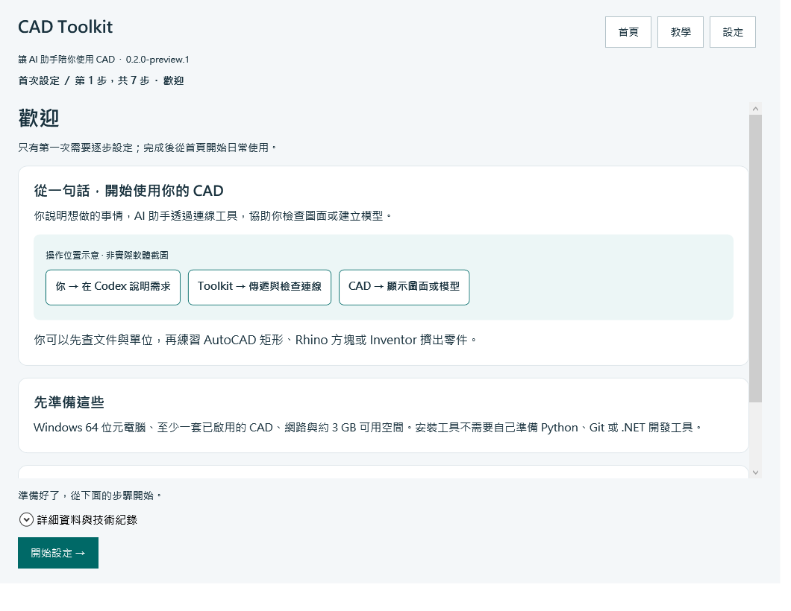

# CAD Toolkit

用中文一步一步設定，讓 Codex 協助你使用 **AutoCAD、Inventor、Rhino**。

**[下載 Windows 安裝程式](https://github.com/allen2123231/cad-toolkit/releases/tag/v0.2.0-preview.1)** · **[第一次使用圖解](docs/getting-started.md)**

適用 Windows x64／Codex 桌面環境。你需要自己的 CAD 授權；只使用其中一套也可以。無須自行安裝 Python、Git 或 .NET SDK。預留約 3 GB 空間。

## 只有第一次需要執行

下載 `CadToolkitSetup.exe` 並開啟，依七步精靈操作：

**歡迎 → 選擇軟體 → 準備 AI 助手 → 安裝連線工具 → 設定 CAD → 確認可以使用 → 第一次練習**

- 可以只安裝一套；有一套通過就能先使用。
- 中途離開會記錄進度，已完成元件不必重做。
- 教學內建於安裝程式，離線也能閱讀，附指令複製和檔案位置按鈕。
- 舊的連線設定會先保留，通過診斷後再逐套啟用新工具。

詳見：[AI 助手](docs/codex.md) · [AutoCAD](docs/autocad.md) · [Inventor](docs/inventor.md) · [Rhino](docs/rhino.md)

## 每次使用

1. 開啟 CAD 與文件。Rhino 執行 `mcpstart`；AutoCAD 確認 dispatcher 已載入。
2. 在 Toolkit 首頁重新檢查連線，依狀態卡片完成需要的操作。
3. 到 Codex 新增對話，先貼上：

> 請確認目前連接的 CAD、文件名稱與單位，先不要修改文件。

核對文件後再提出需求。第一次練習另建空白文件，不使用現有工作文件。

**安裝完成不等於已連線。** 歷史結果會標記時間；重新開啟不會把上次成功當成目前可用。

## 更新與還原

首頁「檢查新版」→「下載並更新」。更新只採用 Toolkit 已發布的測試組合，不追蹤各 MCP 的最新分支，也不在背景自動更新。

「設定」頁提供還原、解除安裝與技術紀錄。舊版本與備份保留；載入中的 Rhino 外掛需自行保存並重新啟動後切換。程式不強制結束 CAD。

## 預覽版限制

目前版本 **0.2.0-preview.1**。實際 CAD GUI 全流程、乾淨 Windows、真實螢幕縮放與真人新手測試尚未全部完成，詳見 [驗收紀錄](docs/validation.md)。其他 CAD 版本未驗證。舊版 [0.1.0-preview.1](https://github.com/allen2123231/cad-toolkit/releases/tag/v0.1.0-preview.1) 繼續保留。

## 開發與後續方向

[開發文件](docs/development.md) · [本版更新內容](docs/release-0.2.0.md) · [驗收紀錄](docs/validation.md)

後續工作（尚未完成）：完整實機測試矩陣、真人新手可用性測試、多視窗目標選擇、外掛註冊自動化、安裝程式簽章，以及其他 AI 用戶端支援。

Toolkit 與三套 MCP 分開維護。必要授權文件與著作權聲明隨套件保留。
