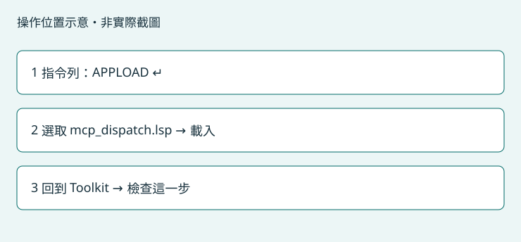

# 讓 AutoCAD 接受連線

將連線檔載入 AutoCAD，讓 AI 助手讀取目前圖面。只有首次或更換 Toolkit 版本需要選取檔案。

## 操作位置

AutoCAD 視窗下方的指令列；若看不到，可按 Ctrl+9 顯示。



以 AutoCAD 2026 操作位置設計；本版完整 GUI 載入流程待實機驗收。其他版本未驗證。

## 只有第一次需要執行

1. 開啟 AutoCAD 與要使用的圖面。先完成目前進行中的繪圖指令，停留在一般命令提示。
2. 按下方「開啟檔案位置」。這裡是目前準備安裝的版本，選取其中的 mcp_dispatch.lsp；不要改用其他版本的同名檔案。
3. 按「複製指令」，切換到 AutoCAD 下方指令列，貼上 APPLOAD 並按 Enter。
4. 在載入應用程式對話框瀏覽到上一步的資料夾，選取 mcp_dispatch.lsp，按「載入」。若看不到資料夾，可用下方「複製完整路徑」。
5. 如出現可信任位置提示，核對路徑確實是 Toolkit 提供的檔案。可在 OPTIONS → 檔案 → 可信任的位置加入這個確切資料夾後重試；不要將整個磁碟設成可信任。
6. 確認 AutoCAD 沒有載入錯誤，再回到這裡按「檢查這一步」。通過後到「確認可以使用」啟用 AutoCAD。

可複製指令：

```text
APPLOAD
```

## 完成後會看到

檢查顯示橋接已連線、目前圖面名稱。詳細資料的 backend 必須是 file_ipc；只有工具程序啟動不算成功。

## 常見問題

- APPLOAD 找不到檔案：先完成「安裝連線工具」，再使用本頁提供的實際路徑。
- 仍無法連線：重新載入本頁檔案，確認沒有其他 AutoCAD 程序。Python 與 LISP 的通訊目錄由 Toolkit 同步產生。
- 每次重開 AutoCAD：確認 dispatcher 已載入；若未設定自動載入，再執行一次 APPLOAD。

## 自選練習：AutoCAD：一個矩形

在 AutoCAD 使用新增圖面建立空白練習檔，單位選毫米。不要切回工作圖面。

貼到 Codex：

> 先確認目前是我新建的空白練習圖面，單位為毫米；如果不是請停止。在原點建立寬 100 mm、高 60 mm 的封閉矩形，讀回尺寸確認。不要修改其他文件，也不要自動儲存。

預期結果：只有一個 100 × 60 mm 矩形，AI 回報尺寸與目前練習圖面。

確認結果後，使用 AutoCAD「另存新檔」存成 CAD練習_矩形.dwg。

[回第一次使用](getting-started.md)
