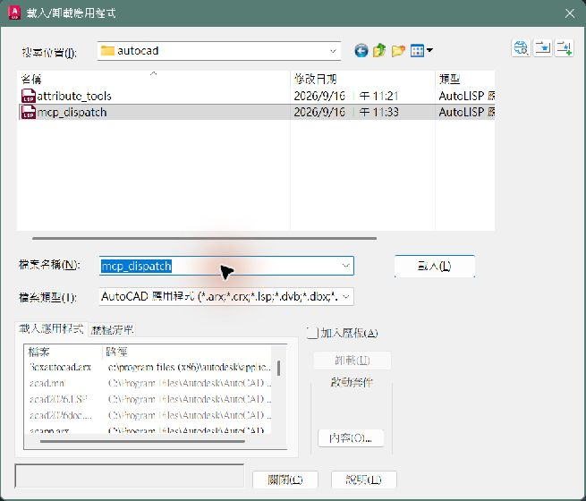

# 讓 AutoCAD 接受連線

將 Toolkit 的連線檔載入 AutoCAD。每次重新開啟 AutoCAD 請確認已載入；更新時使用新版本的檔案。

## 操作位置

AutoCAD 視窗下方的指令列；若看不到，可按 Ctrl+9 顯示。

以 AutoCAD 2026 操作位置設計；本版完整 GUI 載入流程待實機驗收。其他版本未驗證。

## 依序操作

### 1. 在指令列輸入 APPLOAD

操作位置：AutoCAD 視窗下方的指令列

開啟 AutoCAD 與要使用的圖面，完成目前指令。點下方指令輸入區，輸入 APPLOAD，再按 Enter。


AutoCAD 2026 真實指令列；原始像素，未重繪。

完成後：出現「載入／卸載應用程式」視窗，再進入下一步。

### 2. 選取檔案並載入

操作位置：載入／卸載應用程式對話框

按 Toolkit 的「開啟檔案位置」或「複製完整路徑」，找到目前版本的 mcp_dispatch.lsp。先選取檔案，再按「載入」。如出現信任提示，核對這個確切資料夾；不要將整個磁碟設為可信任。



AutoCAD 2026 真實對話框。① 選取 mcp_dispatch　② 按「載入」。

完成後：訊息區顯示檔案載入成功，接著查看下一步。

### 3. 確認載入結果

操作位置：AutoCAD 下方指令列訊息區

對照下方訊息「mcp_dispatch.lsp 成功載入」。保持 AutoCAD 開啟，回 Toolkit 按「檢查這一步」。


使用者提供的 AutoCAD 成功訊息原圖。

完成後：載入訊息只是第一項確認；Toolkit 必須讀到 file_ipc 與目前圖面，才算連線通過。


可複製指令：

```text
APPLOAD
```

## 完成後會看到

檢查顯示橋接已連線、目前圖面名稱。詳細資料的 backend 必須是 file_ipc；只有工具程序啟動不算成功。

## 常見問題

- APPLOAD 找不到檔案：先完成「安裝連線工具」，再使用本頁提供的實際路徑。
- 仍無法連線：重新載入本頁檔案，確認沒有其他 AutoCAD 程序。Python 與 LISP 的通訊目錄由 Toolkit 同步產生。
- 每次重開 AutoCAD：確認 dispatcher 已載入；若未設定自動載入，再執行一次 APPLOAD。

## 自選練習：AutoCAD：一個矩形

在 AutoCAD 使用新增圖面建立空白練習檔，單位選毫米。不要切回工作圖面。

貼到 Codex：

> 先確認目前是我新建的空白練習圖面，單位為毫米；如果不是請停止。在原點建立寬 100 mm、高 60 mm 的封閉矩形，讀回尺寸確認。不要修改其他文件，也不要自動儲存。

預期結果：只有一個 100 × 60 mm 矩形，AI 回報尺寸與目前練習圖面。

確認結果後，使用 AutoCAD「另存新檔」存成 CAD練習_矩形.dwg。

[回第一次使用](getting-started.md)
