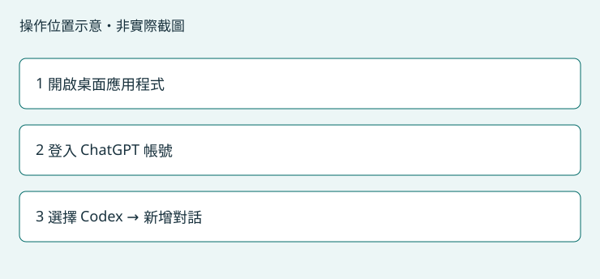

# 準備你的 AI 助手

用桌面應用程式內的 Codex 與本機 CAD 工具對話。帳號登入需要網路。

## 操作位置

Windows 開始功能表 → ChatGPT 或 Codex 桌面應用程式

官方入門文件核對：2026-09-16。名稱與入口依桌面版本而異。

## 只有第一次需要執行

1. 按「官方下載與入門」進入官方頁面，選擇 Windows 桌面版本並完成安裝。Toolkit 不會替你購買帳號或 CAD 授權。
2. 從 Windows 開始功能表開啟 ChatGPT／Codex 桌面應用程式，按登入，使用自己的 ChatGPT 帳號完成瀏覽器登入流程。
3. 新版整合桌面介面：從 ChatGPT 下拉選單選擇 Codex；若你的視窗已叫 Codex，直接使用該視窗。一般網頁聊天不是這個本機工具入口。
4. 在左側使用新增對話／新增任務入口，建立本機對話。若要求資料夾，可選自己的練習資料夾。完成工具啟用後需要再新增一個對話，才能讀取新工具。
5. 回到 CAD Toolkit 按「重新檢查 Codex」。找到程式代表可以繼續安裝；帳號是否登入、對話是否能載入工具，要在最後的唯讀練習確認。

## 完成後會看到

Toolkit 顯示已找到 Codex；桌面應用程式可以建立對話並送出文字。

## 常見問題

- 找不到 Codex：重新啟動剛安裝的桌面應用程式，或安裝官方 Codex CLI 後重試。若仍找不到，展開詳細資料提供錯誤。
- 只有一般聊天：依官方入門頁確認 Codex 入口及帳號可用功能；不同版本的介面名稱可能不同。
- 已安裝 Plugin 但對話看不到工具：完成此處的連線及啟用，再新增本機對話。

[官方下載與入門](https://learn.chatgpt.com/docs/quickstart)

[回第一次使用](getting-started.md)
