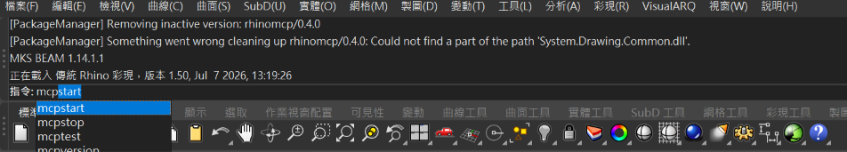
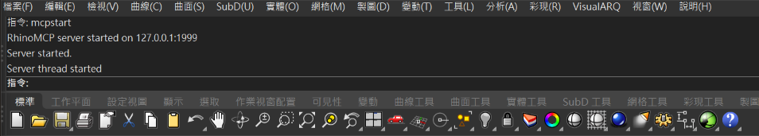

# 讓 Rhino 開始連線

第一次註冊外掛；每次開啟 Rhino 後啟動連線。

## 操作位置

檔案總管的 Toolkit 外掛資料夾，以及 Rhino 上方指令列。

以 Rhino 8 介面設計；本版完整 GUI 註冊及唯讀橋接待實機驗收。其他版本未驗證。

## 只有第一次或更新外掛時

1. 只有第一次或更換外掛版本：先按「開啟檔案位置」。保持整個 rhinomcp.rhp 所在資料夾完整，不要只搬動 .rhp。
2. 若 Rhino 已載入舊版外掛，先自行保存工作並關閉 Rhino，再開啟 Rhino 8。
3. 將 rhinomcp.rhp 拖入 Rhino 視窗，或到外掛程式管理員安裝這個檔案。完成後依下方兩步啟動連線。

## 依序操作

### 1. 開啟 Rhino，輸入 mcpstart

操作位置：Rhino 視窗上方的「指令：」輸入列

開啟 Rhino 8，等待工作區出現。點上方「指令：」，輸入或貼上 mcpstart，再按 Enter。每次重開 Rhino 都需要這一步。



使用者提供的圖 1，移除包含工作檔名的標題列，其餘保持原始像素。上方是先前歷史訊息。

完成後：按下 Enter 後，前往下一步對照新增的啟動訊息。

### 2. 確認啟動結果

操作位置：Rhino 指令列上方的訊息區

確認出現 RhinoMCP server started on 127.0.0.1:1999、Server started. 與 Server thread started。保持 Rhino 開啟，回 Toolkit 檢查。



使用者提供的圖 2，移除包含工作檔名的標題列，其餘保持原始像素。

完成後：Toolkit 會讀取橋接能力、版本與文件摘要；只看到啟動文字還不代表完整診斷通過。


可複製指令：

```text
mcpstart
```

## 完成後會看到

檢查顯示橋接已連線與文件摘要，而且外掛與伺服器版本相符。

## 常見問題

- 尚未開始連線：到 Rhino 上方指令列輸入 mcpstart，完成後重新檢查。
- 版本不符：自行保存並重開 Rhino，再註冊本頁指定版本。
- 有多個 Rhino 視窗／程序：確認要使用的文件，自行保存並關閉其他程序後再檢查；Toolkit 不會猜測目標。

## 自選練習：Rhino：一個方塊

在 Rhino 新增空白模型，選擇毫米範本。先保存或保留原工作文件，避免覆寫。

貼到 Codex：

> 先確認目前是我新建的空白 Rhino 練習文件，單位為毫米；如果不是請停止。在原點建立 20 × 20 × 20 mm 的封閉實體方塊，確認尺寸、有效性與封閉狀態。不要修改其他文件，也不要自動儲存。

預期結果：一個 20 mm 方塊，AI 回報幾何有效且為封閉實體。

確認結果後，以 Rhino「另存新檔」存成 CAD練習_方塊.3dm。

[回第一次使用](getting-started.md)
