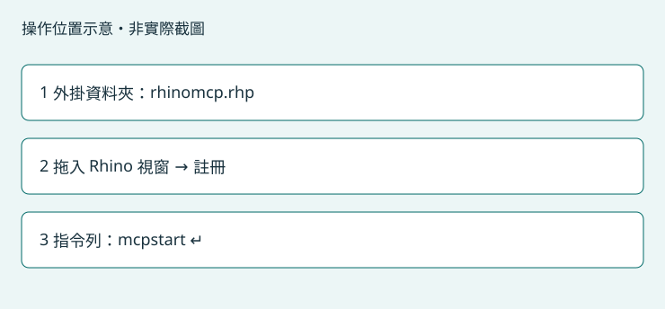

# 讓 Rhino 開始連線

第一次註冊外掛；每次開啟 Rhino 後啟動連線。

## 操作位置

檔案總管的 Toolkit 外掛資料夾，以及 Rhino 上方指令列。



以 Rhino 8 介面設計；本版完整 GUI 註冊及唯讀橋接待實機驗收。其他版本未驗證。

## 只有第一次需要執行

1. 第一次或更新外掛：按「開啟檔案位置」。保留整個資料夾內的檔案，不能只移動 .rhp。
2. 若已載入另一個版本的 RhinoMCP，先自行保存工作並關閉 Rhino，再開啟 Rhino 8；Toolkit 不會強制關閉程式。
3. 將資料夾內的 rhinomcp.rhp 拖到 Rhino 視窗，依 Rhino 提示安裝或註冊外掛。也可在 Rhino 的外掛程式管理員選擇安裝該檔案。
4. 在 Rhino 開啟要使用的文件。按「複製指令」，切換到 Rhino 上方指令列，貼上 mcpstart 並按 Enter。
5. 如 Rhino 顯示未知指令，表示外掛尚未正確載入，請回到第 1 步核對 .rhp 與依賴檔案。
6. 回到 Toolkit 按「檢查這一步」。程式會讀取外掛能力、版本與文件摘要。通過後到「確認可以使用」啟用 Rhino。

可複製指令：

```text
mcpstart
```

## 完成後會看到

檢查顯示橋接已連線與文件摘要，而且外掛與伺服器版本相符。

## 常見問題

- 尚未開始連線：到 Rhino 上方指令列輸入 mcpstart，完成後重新檢查。
- 版本不符：自行保存並重開 Rhino，再註冊本頁指定版本。
- 有多個 Rhino 視窗／程序：確認要使用的文件，自行保存並關閉其他程序後再檢查；Toolkit 不會猜測目標。

## 自選練習：Rhino：一個方塊

在 Rhino 新增空白模型，選擇毫米範本。先保存或保留原工作文件，避免覆寫。

貼到 Codex：

> 先確認目前是我新建的空白 Rhino 練習文件，單位為毫米；如果不是請停止。在原點建立 20 × 20 × 20 mm 的封閉實體方塊，確認尺寸、有效性與封閉狀態。不要修改其他文件，也不要自動儲存。

預期結果：一個 20 mm 方塊，AI 回報幾何有效且為封閉實體。

確認結果後，以 Rhino「另存新檔」存成 CAD練習_方塊.3dm。

[回第一次使用](getting-started.md)
